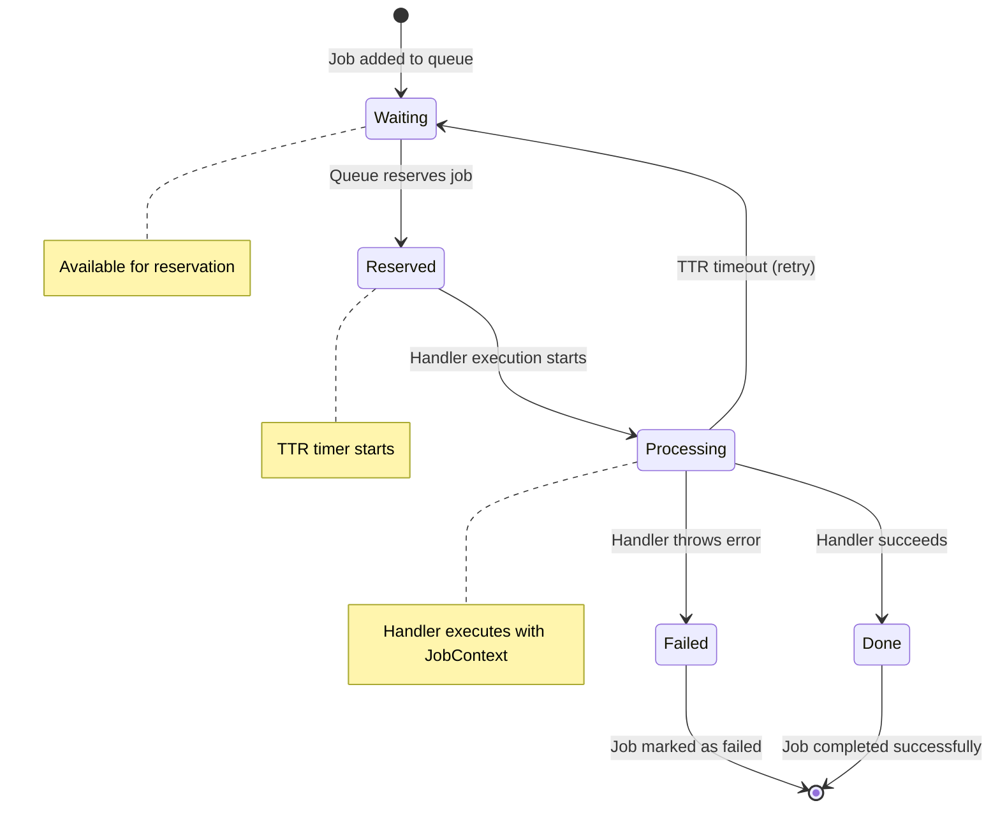
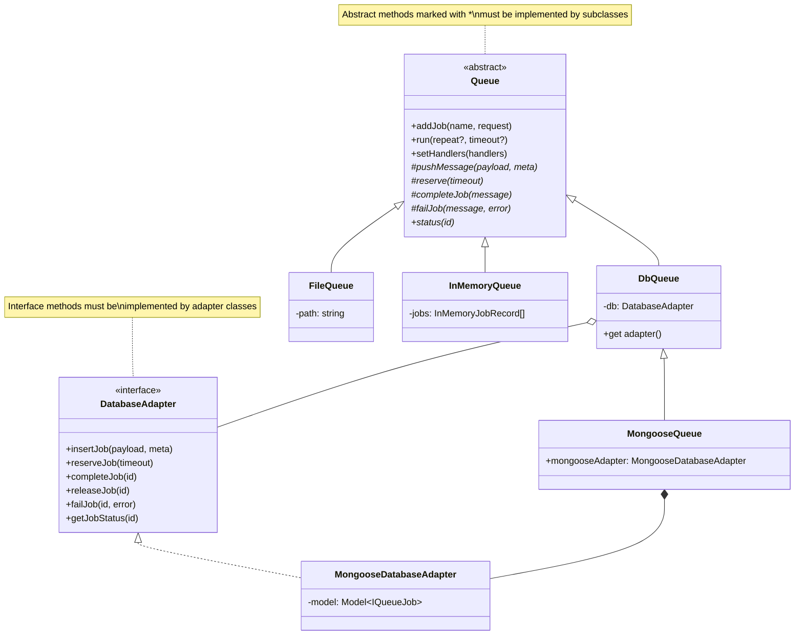
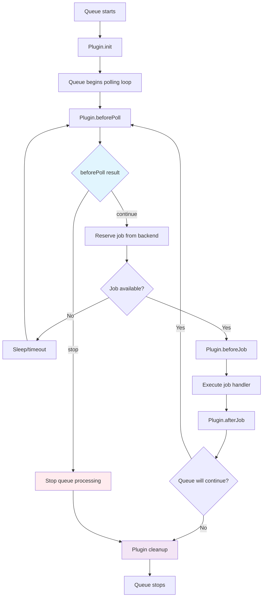

# Design Documentation

## System Overview

The adapter-queue system is built around an abstract `Queue` class that provides a unified interface for job processing across different storage backends. The system follows an event-driven architecture with a plugin system for extensibility.

**Key Design Principle**: The queue itself handles all job processing through its `run()` method in process. Each queue instance can process its own jobs by calling `queue.run()`.

## Core Components

- **Queue**: Abstract base class providing the main job processing logic and the `run()` method
- **Drivers**: Storage-specific implementations (Mongoose, SQLite, Redis, SQS, File, Memory)
- **Plugins**: Extensible hooks for custom behavior
- **Events**: Event system for monitoring and integration
- **Jobs**: Type-safe job definitions with handlers

## Job Processing Sequence Diagram

```mermaid
sequenceDiagram
    participant Client
    participant Queue
    participant Plugin as Plugin System
    participant Driver as Queue Backend
    participant Handler as Job Handler
    participant Events as Event System

    Note over Client,Events: Job Addition Flow
    Client->>Queue: addJob(name, {payload, options})
    Queue->>Queue: Validate payload & create JobMeta
    Queue->>Events: emit('beforePush', event)
    Queue->>Queue: Serialize job data to JSON
    Queue->>Driver: pushMessage(serializedPayload, meta)
    Driver->>Driver: Store job in backend storage
    Driver-->>Queue: Return job ID
    Queue->>Events: emit('afterPush', event)
    Queue-->>Client: Return job ID

    Note over Client,Events: Queue Processing Setup
    Client->>Queue: setHandlers({jobType: handlerFn})
    Queue->>Queue: Store handlers in Map
    Client->>Queue: run(repeat?, timeout?)
    Queue->>Queue: validateHandlers()
    
    Note over Queue,Plugin: Plugin Initialization
    loop For each plugin
        Queue->>Plugin: init({queue})
        Plugin-->>Queue: Return dispose function
        Queue->>Queue: Store disposer
    end

    Note over Queue,Events: Main Processing Loop
    loop While not stopped
        Note over Queue,Plugin: Pre-polling Phase
        loop For each plugin
            Queue->>Plugin: beforePoll()
            Plugin-->>Queue: 'continue' | 'stop'
            break Plugin returns 'stop'
                Queue->>Queue: Set stopped = true
            end
        end
        
        break If stopped
            Queue->>Queue: Break loop
        end

        Note over Queue,Driver: Job Reservation
        Queue->>Driver: reserve(timeout)
        Driver->>Driver: Reserve next job if available
        alt Job available
            Driver-->>Queue: Return QueueMessage
        else No job available
            Driver-->>Queue: Return null
            alt Repeat mode enabled
                Queue->>Queue: Sleep for timeout/500ms
                Queue->>Queue: Continue loop
            else One-time processing
                Queue->>Queue: Break loop
            end
        end

        Note over Queue,Events: Job Processing
        loop For each plugin
            Queue->>Plugin: beforeJob(message)
        end

        Queue->>Queue: handleMessage(message)
        
        Note over Queue,Handler: Message Handling
        Queue->>Queue: Parse payload (JSON)
        Queue->>Events: emit('beforeExec', event)
        Queue->>Queue: Find handler for job type
        Queue->>Queue: Create JobContext
        Queue->>Handler: Execute handler(jobContext, queue)
        
        alt Handler succeeds
            Handler-->>Queue: Success
            Queue->>Events: emit('afterExec', event)
            Queue->>Queue: Return true
        else Handler fails
            Handler-->>Queue: Throw error
            Queue->>Queue: handleError(message, error)
            Queue->>Events: emit('afterError', event)
            Queue->>Queue: Return false
        end

        Note over Queue,Plugin: Post-processing
        loop For each plugin
            Queue->>Plugin: afterJob(message, error?)
        end

        Note over Queue,Driver: Job Completion
        alt Job succeeded
            Queue->>Driver: completeJob(message)
            Driver->>Driver: Mark job as done
        else Job failed
            Queue->>Driver: failJob(message, error)
            Driver->>Driver: Mark job as failed/retry
        end
    end

    Note over Queue,Plugin: Cleanup Phase
    loop For each disposer (reverse order)
        Queue->>Plugin: dispose()
    end
    
    Queue-->>Client: Processing complete
```



## Job Lifecycle States



## Driver Architecture



## Driver Architecture Patterns

Ways to implement the queue interface.

### Pattern 1: Database Queue (DbQueue + DatabaseAdapter)

This pattern tries to make implementing a queue backed by a database as simple as possible. Sine it only requires to implement the `DatabaseAdapter` interface, and that's in term of simple CRUD operations.

It' usually makes sense for general purpose databases, like PostgreSQL, MySQL, etc.

Used by: **Mongoose** and **SQLite**

```
Queue (abstract)
  ↓ extends
DbQueue (concrete - implements Queue's abstract methods)
  ↓ extends
MongooseQueue/SQLiteQueue (convenience wrapper)
  ↓ uses
MongooseDatabaseAdapter/SQLiteDatabaseAdapter (implements DatabaseAdapter)
```

### Pattern 2: Direct Implementation

For drivers that want to implement the queue interface directly, it's also simple, but more flexible than the database adapter pattern.

It usually makes sense if the driver has unique characteristics that are not easily abstracted away, like Redis pub/sub, SQS messaging, etc.

Used by: **Redis**, **SQS**, **File**, and **InMemory**

```
Queue (abstract)
  ↓ extends
RedisQueue/SqsQueue/FileQueue/InMemoryQueue (directly implements abstract methods)
```
### When to Use Each Pattern

**Use Database Abstraction Pattern** when:

- The storage backend is a general-purpose database
- You want to support multiple database drivers with similar functionality
- You need complex query capabilities and transactions

**Use Direct Implementation Pattern** when:

- The storage backend has unique characteristics (Redis pub/sub, SQS messaging, file system)
- You want maximum performance and minimal abstraction
- The backend has specific features you want to leverage


## Event System

The queue system emits events at key points in the job lifecycle:

### Event Types

- **beforePush**: Emitted before a job is added to the queue
- **afterPush**: Emitted after a job is successfully added
- **beforeExec**: Emitted before job handler execution
- **afterExec**: Emitted after successful job handler execution
- **afterError**: Emitted when job handler throws an error

### Event Structure

```typescript
type QueueEvent = 
  | { type: 'beforePush'; name: string; payload: any; meta: JobMeta }
  | { type: 'afterPush'; id: string; name: string; payload: any; meta: JobMeta }
  | { type: 'beforeExec'; id: string; name: string; payload: any; meta: JobMeta }
  | { type: 'afterExec'; id: string; name: string; payload: any; meta: JobMeta; result: any }
  | { type: 'afterError'; id: string; name: string; payload: any; meta: JobMeta; error: unknown };
```

## Plugin System

Plugins provide powerful extensibility points throughout the job processing lifecycle. They can control queue behavior, implement monitoring, handle resource management, and much more.

### Plugin Capabilities



### Plugin Interface

```typescript
interface QueuePlugin {
  init?(context: PluginContext): Promise<(() => Promise<void>) | void>;
  beforePoll?(): Promise<'continue' | 'stop'>;          // Can stop queue
  beforeJob?(message: QueueMessage): Promise<void>;      // Pre-process jobs
  afterJob?(message: QueueMessage, error?: unknown): Promise<void>; // Post-process
}
```

### Example: Logging Plugin

A comprehensive logging plugin that demonstrates all plugin lifecycle hooks:

```typescript
const loggingPlugin = (logger = console): QueuePlugin => {
  const startTimes = new Map<string, number>();
  
  return {
    // Initialize plugin when queue starts
    async init({ queue }) {
      logger.info(`🚀 Queue "${queue.name}" started with logging plugin`);
      
      // Return cleanup function
      return async () => {
        logger.info(`🛑 Queue "${queue.name}" stopped`);
      };
    },

    // Called before each polling attempt
    async beforePoll(): Promise<'continue' | 'stop'> {
      logger.debug('🔍 Polling for new jobs...');
      
      // Example: Stop queue during maintenance hours
      const hour = new Date().getHours();
      if (hour >= 2 && hour <= 4) {
        logger.warn('⏰ Maintenance window - stopping queue');
        return 'stop';
      }
      
      return 'continue';
    },

    // Called before each job execution
    async beforeJob(job: QueueMessage): Promise<void> {
      startTimes.set(job.id, Date.now());
      logger.info(`▶️  Starting job ${job.name} (${job.id})`);
    },

    // Called after each job completion
    async afterJob(job: QueueMessage, error?: unknown): Promise<void> {
      const startTime = startTimes.get(job.id);
      const duration = startTime ? Date.now() - startTime : 0;
      startTimes.delete(job.id);
      
      if (error) {
        logger.error(`❌ Job ${job.name} (${job.id}) failed after ${duration}ms:`, error);
      } else {
        logger.info(`✅ Job ${job.name} (${job.id}) completed in ${duration}ms`);
      }
    }
  };
};

// Usage
const queue = new FileQueue({
  name: 'my-queue',
  path: './queue-data',
  plugins: [loggingPlugin()]
});
```


### Advanced Plugin Patterns

#### Rate Limiting Pattern
```typescript
const rateLimitPlugin = (maxJobsPerSecond: number): QueuePlugin => {
  let lastJobTime = 0;
  const minInterval = 1000 / maxJobsPerSecond;
  
  return {
    async beforeJob(job: QueueMessage): Promise<void> {
      const now = Date.now();
      const elapsed = now - lastJobTime;
      
      if (elapsed < minInterval) {
        await new Promise(resolve => 
          setTimeout(resolve, minInterval - elapsed)
        );
      }
      
      lastJobTime = Date.now();
    }
  };
};
```

## Error Handling and Retry Logic

### TTR (Time To Run) Mechanism

Each job has a TTR (Time To Run) value that determines how long a job can run before being considered timed out:

1. When a job is reserved, an expiration time is set (`reserveTime + TTR`)
2. If a job exceeds its TTR, it's automatically released back to the queue
3. The attempt counter is incremented on each retry
4. Jobs can be retried multiple times until manually failed

### Error Types

- **Handler Errors**: Exceptions thrown by job handlers → job marked as failed
- **TTR Timeout**: Job exceeds time limit → job released for retry
- **System Errors**: Infrastructure issues → depends on driver implementation

## Type Safety

The system provides compile-time type safety through:

```typescript
interface MyJobs {
  'send-email': { to: string; subject: string; body: string };
  'process-image': { url: string; width: number; height: number };
}

const queue = new MongooseQueue<MyJobs>({ name: 'my-queue' });

// Type-safe job addition
queue.addJob('send-email', {
  payload: { to: 'user@example.com', subject: 'Hello', body: 'World' }
});

// Type-safe handler registration
queue.setHandlers({
  'send-email': async (job) => {
    // job.payload is typed as { to: string; subject: string; body: string }
    await sendEmail(job.payload.to, job.payload.subject, job.payload.body);
  }
});
```