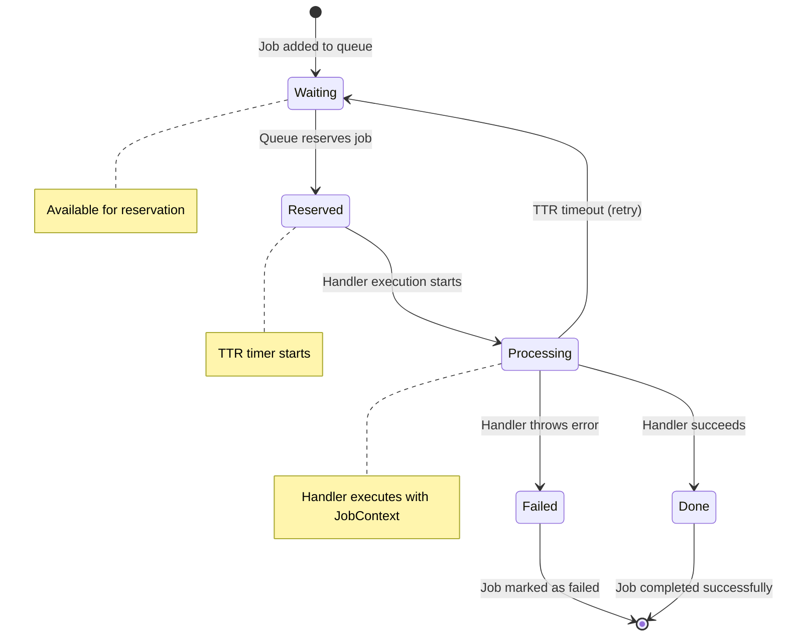
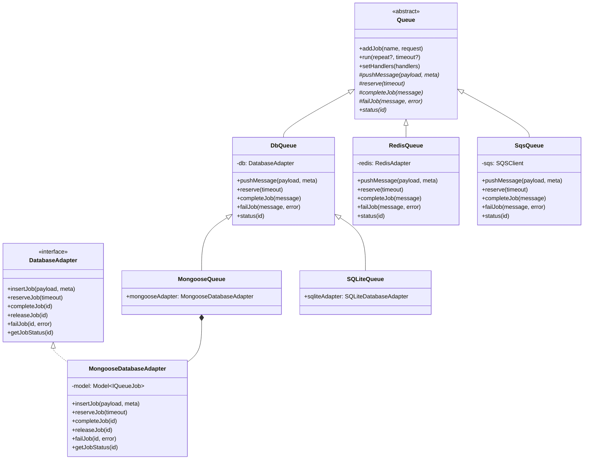

# adapter-queue Design Documentation

This document provides a comprehensive overview of the adapter-queue system architecture and job processing flow.

## System Overview

The adapter-queue system is built around an abstract `Queue` class that provides a unified interface for job processing across different storage backends. The system follows an event-driven architecture with a plugin system for extensibility.

**Key Design Principle**: The queue itself handles all job processing through its `run()` method. There is no separate worker process - each queue instance can process its own jobs by calling `queue.run()`.

## Core Components

- **Queue**: Abstract base class providing the main job processing logic and the `run()` method
- **Drivers**: Storage-specific implementations (Mongoose, SQLite, Redis, SQS, File, Memory)
- **Plugins**: Extensible hooks for custom behavior
- **Events**: Event system for monitoring and integration
- **Jobs**: Type-safe job definitions with handlers

## Job Processing Sequence Diagram

```mermaid
sequenceDiagram
    participant Client
    participant Queue
    participant Plugin as Plugin System
    participant Driver as Storage Driver
    participant Handler as Job Handler
    participant Events as Event System

    Note over Client,Events: Job Addition Flow
    Client->>Queue: addJob(name, {payload, options})
    Queue->>Queue: Validate payload & create JobMeta
    Queue->>Events: emit('beforePush', event)
    Queue->>Queue: Serialize job data to JSON
    Queue->>Driver: pushMessage(serializedPayload, meta)
    Driver->>Driver: Store job in backend storage
    Driver-->>Queue: Return job ID
    Queue->>Events: emit('afterPush', event)
    Queue-->>Client: Return job ID

    Note over Client,Events: Queue Processing Setup
    Client->>Queue: setHandlers({jobType: handlerFn})
    Queue->>Queue: Store handlers in Map
    Client->>Queue: run(repeat?, timeout?)
    Queue->>Queue: validateHandlers()
    
    Note over Queue,Plugin: Plugin Initialization
    loop For each plugin
        Queue->>Plugin: init({queue})
        Plugin-->>Queue: Return dispose function
        Queue->>Queue: Store disposer
    end

    Note over Queue,Events: Main Processing Loop
    loop While not stopped
        Note over Queue,Plugin: Pre-polling Phase
        loop For each plugin
            Queue->>Plugin: beforePoll()
            Plugin-->>Queue: 'continue' | 'stop'
            break Plugin returns 'stop'
                Queue->>Queue: Set stopped = true
            end
        end
        
        break If stopped
            Queue->>Queue: Break loop
        end

        Note over Queue,Driver: Job Reservation
        Queue->>Driver: reserve(timeout)
        Driver->>Driver: Get next available job
        alt Job available
            Driver->>Driver: Mark as reserved, set TTR
            Driver-->>Queue: Return QueueMessage
        else No job available
            Driver-->>Queue: Return null
            alt Repeat mode enabled
                Queue->>Queue: Sleep for timeout/500ms
                Queue->>Queue: Continue loop
            else One-time processing
                Queue->>Queue: Break loop
            end
        end

        Note over Queue,Events: Job Processing
        loop For each plugin
            Queue->>Plugin: beforeJob(message)
        end

        Queue->>Queue: handleMessage(message)
        
        Note over Queue,Handler: Message Handling
        Queue->>Queue: Parse JSON payload
        Queue->>Events: emit('beforeExec', event)
        Queue->>Queue: Find handler for job type
        Queue->>Queue: Create JobContext
        Queue->>Handler: Execute handler(jobContext, queue)
        
        alt Handler succeeds
            Handler-->>Queue: Success
            Queue->>Events: emit('afterExec', event)
            Queue->>Queue: Return true
        else Handler fails
            Handler-->>Queue: Throw error
            Queue->>Queue: handleError(message, error)
            Queue->>Events: emit('afterError', event)
            Queue->>Queue: Return false
        end

        Note over Queue,Plugin: Post-processing
        loop For each plugin
            Queue->>Plugin: afterJob(message, error?)
        end

        Note over Queue,Driver: Job Completion
        alt Job succeeded
            Queue->>Driver: completeJob(message)
            Driver->>Driver: Mark job as done
        else Job failed
            Queue->>Driver: failJob(message, error)
            Driver->>Driver: Mark job as failed/retry
        end
    end

    Note over Queue,Plugin: Cleanup Phase
    loop For each disposer (reverse order)
        Queue->>Plugin: dispose()
    end
    
    Queue-->>Client: Processing complete
```



## Job Lifecycle States



## Driver Architecture



## Event System

The queue system emits events at key points in the job lifecycle:

### Event Types

- **beforePush**: Emitted before a job is added to the queue
- **afterPush**: Emitted after a job is successfully added
- **beforeExec**: Emitted before job handler execution
- **afterExec**: Emitted after successful job handler execution
- **afterError**: Emitted when job handler throws an error

### Event Structure

```typescript
type QueueEvent = 
  | { type: 'beforePush'; name: string; payload: any; meta: JobMeta }
  | { type: 'afterPush'; id: string; name: string; payload: any; meta: JobMeta }
  | { type: 'beforeExec'; id: string; name: string; payload: any; meta: JobMeta }
  | { type: 'afterExec'; id: string; name: string; payload: any; meta: JobMeta; result: any }
  | { type: 'afterError'; id: string; name: string; payload: any; meta: JobMeta; error: unknown };
```

## Plugin System

Plugins provide extensibility points throughout the job processing lifecycle:

### Plugin Interface

```typescript
interface QueuePlugin {
  init?(context: PluginContext): Promise<(() => Promise<void>) | void>;
  beforePoll?(): Promise<'continue' | 'stop'>;
  beforeJob?(message: QueueMessage): Promise<void>;
  afterJob?(message: QueueMessage, error?: unknown): Promise<void>;
}
```

### Plugin Lifecycle

1. **Initialization**: `init()` called when queue starts
2. **Before Poll**: `beforePoll()` called before each job reservation attempt
3. **Before Job**: `beforeJob()` called before job handler execution
4. **After Job**: `afterJob()` called after job completion (success or failure)
5. **Disposal**: Cleanup function returned from `init()` called on shutdown

## Error Handling and Retry Logic

### TTR (Time To Run) Mechanism

Each job has a TTR (Time To Run) value that determines how long a job can run before being considered timed out:

1. When a job is reserved, an expiration time is set (`reserveTime + TTR`)
2. If a job exceeds its TTR, it's automatically released back to the queue
3. The attempt counter is incremented on each retry
4. Jobs can be retried multiple times until manually failed

### Error Types

- **Handler Errors**: Exceptions thrown by job handlers → job marked as failed
- **TTR Timeout**: Job exceeds time limit → job released for retry
- **System Errors**: Infrastructure issues → depends on driver implementation

## Type Safety

The system provides compile-time type safety through:

```typescript
interface MyJobs {
  'send-email': { to: string; subject: string; body: string };
  'process-image': { url: string; width: number; height: number };
}

const queue = new MongooseQueue<MyJobs>({ name: 'my-queue' });

// Type-safe job addition
queue.addJob('send-email', {
  payload: { to: 'user@example.com', subject: 'Hello', body: 'World' }
});

// Type-safe handler registration
queue.setHandlers({
  'send-email': async (job) => {
    // job.payload is typed as { to: string; subject: string; body: string }
    await sendEmail(job.payload.to, job.payload.subject, job.payload.body);
  }
});
```

## Performance Considerations

### Polling Strategy

- **Long Polling**: Supported by drivers like SQS for efficient waiting
- **Short Polling**: Used by database drivers with configurable sleep intervals
- **Batch Processing**: Single `run()` call processes all available jobs

### Storage Optimization

- **Indexes**: Database drivers create appropriate indexes for job queries
- **Atomic Operations**: Job reservation uses atomic operations to prevent race conditions
- **Connection Pooling**: Managed by underlying storage drivers

### Memory Management

- **Event Listeners**: Properly cleaned up after job processing
- **Plugin Disposal**: All plugins disposed in reverse order on shutdown
- **Buffer Management**: Job payloads handled as Buffers for efficiency

## Configuration Options

### Queue Options

```typescript
interface QueueOptions {
  name: string;                    // Required queue name
  ttrDefault?: number;             // Default TTR in seconds (300)
  plugins?: QueuePlugin[];         // Optional plugins
}
```

### Job Options

```typescript
interface JobOptions {
  ttr?: number;                    // Time to run override
  delaySeconds?: number;           // Delay before job becomes available
  priority?: number;               // Job priority (higher = first)
}
```

## Usage Patterns

### Single-Process Job Processing

The simplest usage pattern - process all available jobs once:

```typescript
const queue = new MongooseQueue<MyJobs>({ name: 'my-queue' });

queue.setHandlers({
  'send-email': async (job) => {
    await emailService.send(job.payload);
  }
});

// Process all available jobs once and exit
await queue.run();
```

### Continuous Job Processing

For long-running processes that continuously poll for new jobs:

```typescript
// Run continuously, polling every 5 seconds when queue is empty
await queue.run(true, 5);
```

### Multiple Queue Instances

You can run multiple queue instances for different job types or scaling:

```typescript
// Email queue
const emailQueue = new MongooseQueue<EmailJobs>({ name: 'emails' });
emailQueue.setHandlers({ 'send-email': emailHandler });

// Image processing queue  
const imageQueue = new MongooseQueue<ImageJobs>({ name: 'images' });
imageQueue.setHandlers({ 'process-image': imageHandler });

// Run both queues concurrently
await Promise.all([
  emailQueue.run(true, 3),
  imageQueue.run(true, 3)
]);
```

### Microservice Pattern

Each microservice can have its own queue processing:

```typescript
// In your Express/Fastify app
const queue = new MongooseQueue<AppJobs>({ name: 'app-jobs' });
queue.setHandlers(jobHandlers);

// Process jobs in background
queue.run(true, 5).catch(console.error);

// Add jobs from HTTP endpoints
app.post('/api/send-email', async (req, res) => {
  const jobId = await queue.addJob('send-email', { 
    payload: req.body 
  });
  res.json({ jobId });
});
```

## Architecture Benefits

### Simplicity
- **No Worker Complexity**: No separate worker processes to manage
- **Direct Integration**: Queue processing is part of your application
- **Easy Testing**: Simple to test job processing in unit tests

### Flexibility
- **Multiple Patterns**: Support both one-time and continuous processing
- **Scaling Options**: Run multiple instances, multiple queues, or both
- **Plugin System**: Extend functionality without modifying core code

### Type Safety
- **Compile-time Validation**: Job payloads are type-checked
- **Handler Safety**: Handlers receive correctly typed job data
- **IDE Support**: Full autocomplete and error checking

This design provides a robust, type-safe, and extensible job queue system suitable for production use across different storage backends and deployment scenarios.